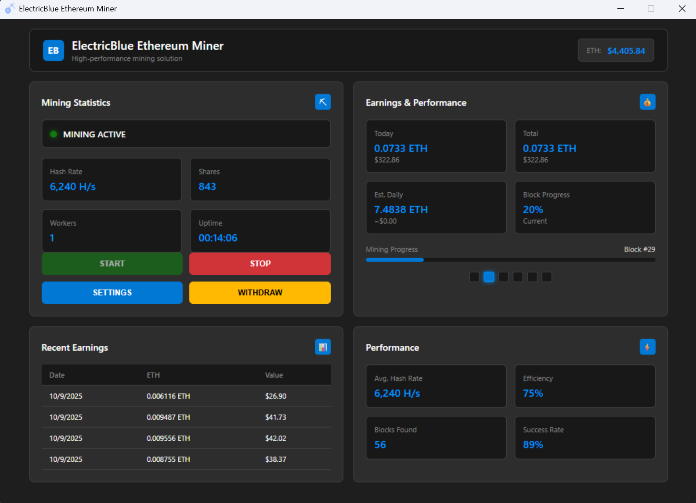

# ElectricBlue-Ethereum-Miner
ElectricBlue Ethereum Miner is an easy-to-use Windows ETH mining software that lets anyone mine Ethereum directly from their PC or laptop — no expensive hardware or middleman needed.

ElectricBlue connects you straight to trusted Ethereum mining pools, allowing your computer to contribute processing power and earn ETH coins directly into your wallet. Once you reach 0.1 ETH, you can instantly withdraw your balance — simple, secure, and automatic!

💡 Why Choose ElectricBlue Ethereum Miner?

✅ Works on any Windows PC or laptop

✅ Direct mining to ETH pools (no third-party fees)

✅ Real-time balance updates

✅ Automatic ETH withdrawals at 0.1 threshold

✅ Beginner-friendly setup — start in minutes

💰 Get Started Today:

Official Ethereum Wallets ➜ www.ethereum.org/wallets

Telegram ➜ www.t.me/CryptoFans101

📘 Recommended For:

Beginners learning how to mine Ethereum

Crypto enthusiasts looking for easy ETH mining software

Users who want to mine Ethereum without a GPU rig

People searching for passive crypto income options

⚠️ Disclaimer:
Mining results vary based on your hardware, energy cost, and network difficulty. Always use official and verified mining software. This video is for educational purposes only — not financial advice.

#️⃣ Hashtags:
#EthereumMining #ETHMiner #CryptoMining #ElectricBlueMiner #Ethereum #MineEthereum #WindowsMiner #CryptoSoftware #PassiveIncome #ETH2025 #Blockchain #EthereumWallet
